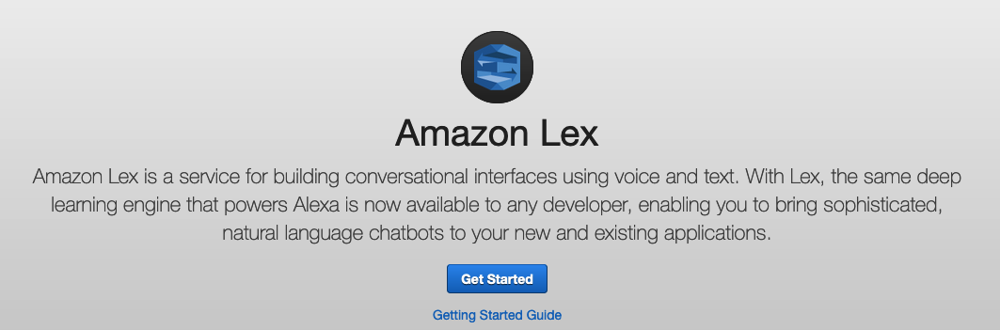
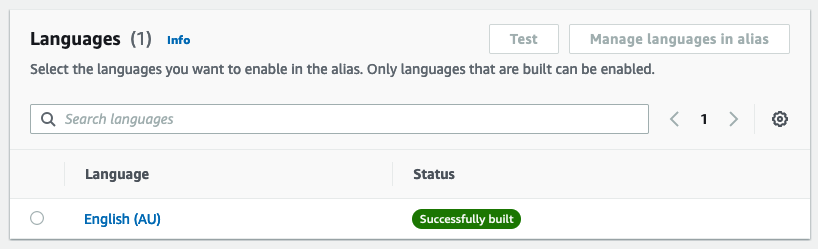

# Amazon Lex Workshop

## Introduction

Welcome to the Amazon Lex workshop!

Amazon Lex is a managed artificial intelligence (AI) service which uses natural language processing. Lex allows you to easily build conversational chatbots - without any experience or knowledge of machine learning! In fact, Lex uses the same conversational engine which powers Amazon Alexa devices.

In this workshop you are going to build a chatbot and learn how the voice user interface works with Amazon Lex.

## Setup
We first need to get you setup with an AWS account to complete this workshop. Accounts are being provided so you don't need to use your own.

1. Go to [https://dashboard.eventengine.run/login](https://dashboard.eventengine.run/login) and you will be redirected to the page below.


2. Enter the event hash you have received from your instructor and click on **Accept Terms & Login**.

3. Click **Email One-Time Password (OTP)** and you will be redirected to this page:


4. Enter your email address and click on **Send passcode**. You will then see this screen:


5. Check your mailbox, copy-paste the one-time password, and click **Sign In**.
6. You will be redirected to the "Team Dashboard". Click **AWS Console**.
7. On the next screen, click **Open AWS Console** and you will be redirected to the AWS Console, ready to start the workshop!

## Create the chatbot

1. In the AWS Console and search for **Amazon Lex** in the search bar:


2. Click on **Amazon Lex** to show the console and click on the **Get Started** button.



3. Click **Create bot**.


4. This will show the _Configure bot settings_ page, allowing you to create and configure your new bot. On this page, use the following settings:

* **Creation method:** Create a blank bot
* **Bot name:** CanteenBot
* **Description:** My first chatbot
* **IAM permissions:** Create a role with basic Amazon Lex permissions
* **Children's Online Privacy Protection Act (COPPA):** No
* **Session timeout:** 5 minutes

Click **Next** to proceed to the language settings.

5. On the _Add language to bot_ screen, use the following settings:

* **Selection language:** English (AU)
* **Description:** _You can leave this blank
* **Voice interaction:** Olivia
* **Intent classification confidence score threshold:** 0.40

Click **Done** to create your chatbot.

## Intents

Once you have created your chatbot the _Intent: NewIntent_ screen should appear. An intent represents an action that users want to perform. You create a bot to support one or more related intents. For example, you might create a bot that orders pizza and drinks. This would mean you’ll create an _OrderFood_ intent and an _OrderDrink_ intent as these are two separate actions.

Let's create an intent to order drinks.

6. On the _NewIntent_ screen use the following settings:

* **Intent name:** OrderDrink
* **Description:** _Leave this blank_

### Utterances

Scroll to the _Sample utterances_ section. Utterances are what a user might say to trigger this intent. For example, the user might say "Can I order a pizza please" or "I want to order a pizza".

Note, the user does not need to _exactly_ say these phrases - Amazon Lex extrapolates based on the sample utterances to interpret any user input that may vary from the samples.

7. Input the sample utterances by copying and pasting the below text in the sample utterances text box and pressing `Enter`. You can also input other utterances that you think a user would say when they order drinks from the canteen.

    `I would like a {size} {flavour} {drink} please`

    `Can I have a {size} {drink}`

    `I want a {drink}`


### Slots

In the utterances you would have noticed things like `{size}` , `{flavour}` , and `{drink}`. These are called slots.

Slots are elements within your utterances that may change based on the user wanting different variations to their actions. For example, "I want to order a **pepperoni** pizza" versus "I want to order a **vegetarian** pizza."

In this example, _pepperoni_ and _vegetarian_ can be classified as a slot called "flavour". This means the sample utterance can be fulfilled with "I want to order a `{flavour}` pizza" instead.

When the chatbot starts running, Amazon Lex prompts the user for specific slot values. The user must provide values for all required slots before Amazon Lex can fulfill the intent.

#### Create the Slot Types

Each slot has a type. You can create your custom slot types or use built-in slot types. For example, you might create and use the following slot types for the intent:
* **Size** - with values `Small`, `Medium`, and `Large`
* **Crust** - with values `Thick` and `Thin`

Amazon Lex also provides built-in slot types. For example, `AMAZON.NUMBER` is a built-in slot type that you can use for the number of pizzas ordered.

Before we create our slots we need to define the slot types we will use.

8. Click **Save intent** at the bottom of the window, as we need to go to a different screen to setup our slot types.
9. In the left-hand menu, click **< Back to intents list**
10. In the left-hand menu, click **Slot types**


11. Click **Add slot type** → **Add blank slot type**
12. For the **Slot type name** use `FlavourType` and click **Add**
13. This will show the _Slot type: FlavourType_ screen. Add the following values in the _Slot type values_ section: `strawberry` , `watermelon`, and `lemon`


14. Click the **Save Slot type** button to save the slot type, then click **< Slot types** in the left-hand menu to go back.
15. Repeat the above steps to create two more Slot types:

* **Slot type name:** SizeType
    * **Values:** `small` , `medium` , `large`

* **Slot type name:** DrinkType
    * **Values:** `ice tea` , `energy drink` , `flavoured water`

#### Create the Slots

Now that we have created our Slot types, we can create the Slots.

16. Navigate back to the `OrderDrink` intent:


17. Click the `OrderDrink` intent to access the settings.

19. Scroll down to the _Slots_ section.

21. Click **Add slot**


23. Create a Slot with the following settings:
* **Required for this intent:** Ticked
* **Name:** `flavour`
* **Slot type:** `FlavourType`
* **Prompts:** `what flavour did you want?`
* Click **Add** to add the slot

24. Repeat the above steps to create two more Slots:

* **Required for this intent:** Ticked
* **Name:** `size`
* **Slot type:** `SizeType`
* **Prompts:** `what size drink did you want?`

and…

* **Required for this intent:** Ticked
* **Name:** `drink`
* **Slot type:** `DrinkType`
* **Prompts:** `what drink did you want?`

P.S. If you scroll back up to the _Sample utterances_ section you will see the slots are now coloured to match the colour beside the respective Slot.


25. Click **Save intent** at the bottom of the screen to save the changes.

## Ready to test!

We are now ready to test our chatbot!

26. Click **Build** at the bottom of the screen. This may take a few minutes. You can see progress in the blue bar at the top of the screen.
27. Once the build has completed click the **Test** button to test the chatbot. Try talking to the chatbot with a message like: `Can I order a drink?`.

Congratulations on building your first chatbot!

## Adding buttons

Sometimes you may want to make the responses available to users as buttons. You can add that by specifying cards in your slots.

28. Go back into the `OrderDrink` intent and scroll down to _Slots_
29. Choose a slot where you would like to see buttons for the responses and expand the slot by clicking the disclosure arrow on the left.


30. Click the **Advanced options** button.
31. In the screen that appears, scroll to _Slot prompts_ and expand the prompt by clicking the disclosure arrow on the left.


32. Click **More prompt options**.
33. In the _Slot prompts_ screen that appears, click **Add** → **Add card group**. Use the following settings:
* **Image URL:** _Leave blank_
* **Title:** Drink sizes
* **Subtitle:** What size drink would you like?
* Expand **Buttons** and click **Add button** to add a button for each response you would like to provide. The button **title** is displayed to the user, and the button **value** is sent to Lex - so the value should match the slot type values. For example, the title for a button might be `Small` and the value `small`.


34. When you have added all your buttons, click the **Update prompts** button.
35. On the next screen, click **Update slot**
36. Finally, build and test your chatbot again and try it out - when prompted for size you should now be presented with the options in buttons.


## Adding Lambda integration

In the previous section you were able to build out the basic voice interactions on Amazon Lex.

Your chatbot has received your response and knows that you want to order a small watermelon energy drink. Now you need to add extra responses from the chatbot so your user knows that it has received it properly. To do this we will need to use the Lambda service.

### How to fulfill the intent?

You can undertake custom actions once the intent is triggered. This can be done via code and we recommend that you create a Lambda function to fulfill the intent.

### Lambda Functions

Lambda allows you to write code which performs custom actions in response to events.

1. Go to Lambda by searching for the service in the Console and selecting the Lambda service.


2. In the Lambda function click the **Create Function** button.


3. Select `Author from scratch` and set the function name as `CanteenBot`. Have the runtime set to `Node.js.14.x.` and click `Create function`.


5. Delete the code that is within `index.js` and copy and paste the code below into `index.js`

```javascript
 'use strict';
 // --------------- Helpers to build responses which match the structure of the necessary dialog actions -----------------------

function close(intentName, fulfillmentState, message, responseCard) {
     return {
         sessionState: {
          dialogAction: {
           type: 'Close'
          },
          intent: {
           confirmationState: 'Confirmed',
           name: intentName,
           state: fulfillmentState,
          },
         },
         messages: [message]
     };
 }

 // --------------- Functions that control the skill's behavior -----------------------

 //Used to fulfill the ordering for canteen food.

 //Function where the intent request is submitted and where you can customise.
 function OrderDrink(intentRequest, callback) {

     const intentName = intentRequest.sessionState.intent.name;
     const source = intentRequest.invocationSource;
     console.log(intentRequest);

     if (source === 'FulfillmentCodeHook') {

         //Used once all slots are fulfilled.

         const slots = intentRequest.sessionState.intent.slots;
         console.log(slots);
         const drink = slots.drink.value.interpretedValue;
         const size = slots.size.value.interpretedValue;
         const flavour = slots.flavour.value.interpretedValue;

         //Change anything after 'content:' to display another message
         //apart from the usual "Great! Your drink is available for pickup soon. Thanks for using CanteenBot!"
         //To refer to the drink, size and flavour variables - use ${drink}, ${size} and ${flavour} within your bracketed text.

         callback(close(intentName, 'Fulfilled', {
             contentType: 'PlainText',
             content: `Great!  Your ${size} ${flavour} ${drink} will be available for pickup soon.  Thanks for using CanteenBot!`
         }));
         return;
     }

 }

 // --------------- Intents -----------------------

 /**Called when the user specifies an intent for this skill.*/

 function dispatch(intentRequest, callback) {

     console.log(`intent=${intentRequest.sessionState.intent.name}`);

     const name = intentRequest.sessionState.intent.name;
     console.log(name);

     // dispatch to the intent handlers - checks if the intent is OrderDrink and then initiates that function.
     if (name.startsWith('OrderDrink')) {
         return OrderDrink(intentRequest, callback);
     }
     throw new Error(`Intent with name ${name} not supported`);
 }

 // --------------- Main handler -----------------------

 // Route the incoming request based on intent.
 // The JSON body of the request is provided in the event slot.
 exports.handler = (event, context, callback) => {

     console.log(JSON.stringify(event));

     try {
         dispatch(event, (response) => callback(null, response));
     } catch (err) {
         callback(err);
     }
 };

 /*MIT No Attribution

 Copyright 2022 Amazon.com, Inc. or its affiliates. All Rights Reserved.

 Permission is hereby granted, free of charge, to any person obtaining a copy of this
 software and associated documentation files (the "Software"), to deal in the Software
 without restriction, including without limitation the rights to use, copy, modify,
 merge, publish, distribute, sublicense, and/or sell copies of the Software, and to
 permit persons to whom the Software is furnished to do so.

 THE SOFTWARE IS PROVIDED "AS IS", WITHOUT WARRANTY OF ANY KIND, EXPRESS OR IMPLIED,
 INCLUDING BUT NOT LIMITED TO THE WARRANTIES OF MERCHANTABILITY, FITNESS FOR A
 PARTICULAR PURPOSE AND NONINFRINGEMENT. IN NO EVENT SHALL THE AUTHORS OR COPYRIGHT
 HOLDERS BE LIABLE FOR ANY CLAIM, DAMAGES OR OTHER LIABILITY, WHETHER IN AN ACTION
 OF CONTRACT, TORT OR OTHERWISE, ARISING FROM, OUT OF OR IN CONNECTION WITH THE
 SOFTWARE OR THE USE OR OTHER DEALINGS IN THE SOFTWARE.*/
```

6. Click `Deploy` in the right-hand corner above the code console to save the code.


7. Go back to the Amazon Lex console and to the `OrderDrink` intent.
8. Scroll to near the bottom of the _Intent: OrderDrink_ page to the _Fulfillment_ section and expand the section **On successful fulfillment**


10. Click the **Advanced options** button.
11. On the next screen, tick **Use a Lambda function for fulfillment**
12. Click **Update options**
13. Back on the main screen, click **Save intent**

We now need to link the Lambda function to the intent.

14. On the left-hand menu, click **< Back to intents list**
15. On the left-hand menu, select **Aliases** (under Deployment)
16. Click the alias for the bot - there should only be one listed, don't worry if it doesn't match the name in the screen shot below.


17. On the alias screen, in the _Languages_ section click the language which the bot has been configured for - this should be **English (AU)**

 
 
 18. You can now configure the Lambda function to run. In the **Source** drop-down select `CanteenBot` and in the **Lambda function version or alias** select `$LATEST`.
 19. Click the **Save** button.

Let's now test our new bot with Lambda integration!

20. Go back to the **Intents** page in the Console.


22. Click the **Build** button.
23. Once the build has completed, click the **Test** button.
24. Type `I would like a small watermelon energy drink`.

If successful, there should be a response of “Great! your small watermelon energy drink will be available for pickup soon. Thanks for using CanteenBot!”.